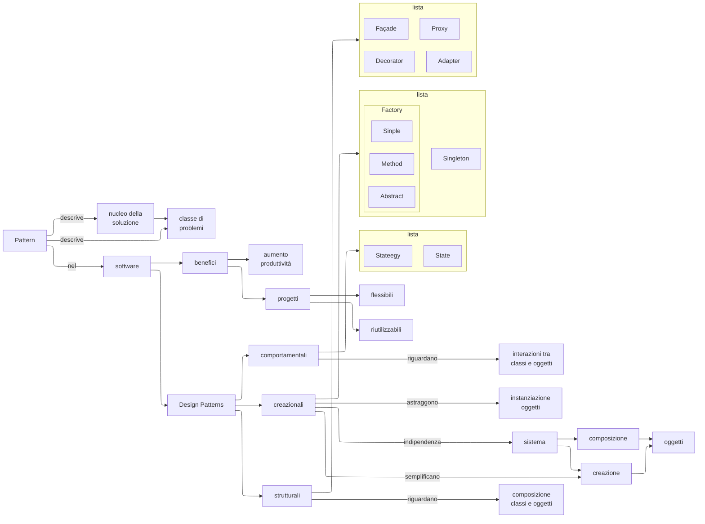
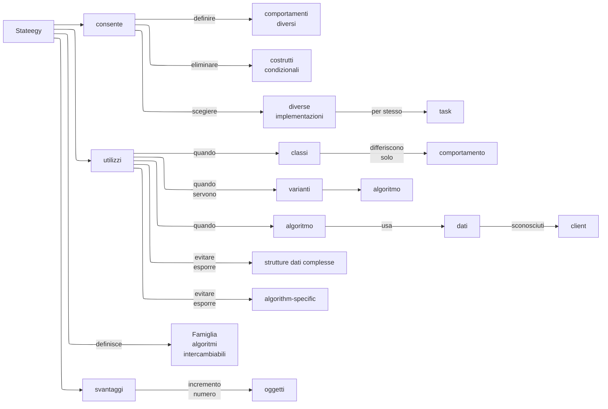
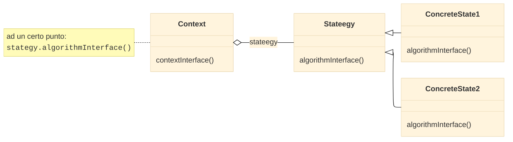
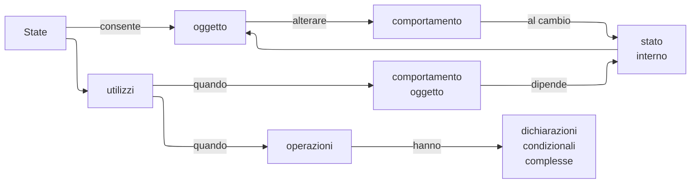
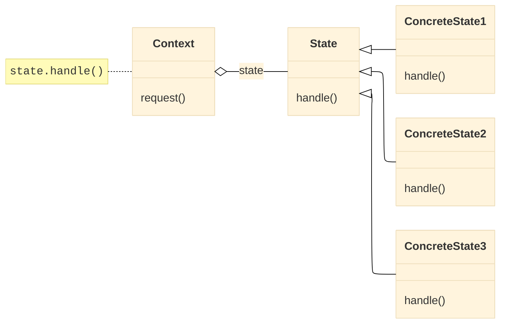

```mermaid
---
config:
    layout: elk
    elk: {
        considerModelOrder: "PREFER_EDGES",
        forceNodeModelOrder: true
    }
---
graph LR

    Pattern -- descrive --> CP[classe di<br>problemi]
    Pattern -- descrive --> NS[nucleo della<br>soluzione] --> CP
    Pattern -- nel --> software --> benefici
    benefici --> AP[aumento<br>produttività]
    benefici --> progetti --> flessibili & riutilizzabili
    software --> DP[Design Patterns] --> comportamentali & creazionali & strutturali

    comportamentali -- riguardano --> ICO[interazioni tra<br>classi e oggetti]
    comportamentali --> l_2
    subgraph l_2[lista]
    direction LR
        Stateegy~~~
        State
    end

    creazionali -- astraggono --> CO[instanziazione<br>oggetti]
    creazionali -- indipendenza --> sistema
    sistema --> composizione & creazione --> oggetti
    creazionali -- semplificano --> creazione
    creazionali --> l_0
    subgraph l_0[lista]
    direction LR
        subgraph Factory
        direction TB
            Sinple ~~~ Method ~~~ Abstract
        end
        Factory ~~~ Singleton
    end

    strutturali -- riguardano --> CCO[composizione<br>classi e oggetti]
    strutturali --> l_1
    subgraph l_1[lista]
    direction LR
        Decorator~~~
        Adapter
        Façade~~~
        Proxy
    end
```

# Comportamentali

## Stateegy

```mermaid
---
config:
    layout: elk
    elk: {
        considerModelOrder: "PREFER_EDGES",
        forceNodeModelOrder: true
    }
---
graph LR
Stateegy -- definisce --> FA[Famiglia<br>algoritmi<br>intercambiabili]
Stateegy --> consente
consente -- definire --> CD[comportamenti<br>diversi]
consente -- eliminare --> CC[costrutti<br>condizionali]
consente -- scegiere --> DI[diverse<br>implementazioni] -- per stesso --> task
Stateegy --> utilizzi
utilizzi -- quando --> classi -- differiscono<br>solo --> comportamento
utilizzi -- quando<br>servono --> varianti --> algoritmo
utilizzi -- quando --> al[algoritmo] -- usa --> dati -- sconosciuti --> client
utilizzi -- evitare<br>esporre --> SDC[strutture dati complesse] & algorithm-specific
Stateegy --> svantaggi
svantaggi -- incremento<br>numero --> oggetti
```

### Implementazione

```mermaid
---
config:
    layout: elk
    theme: "base"
    themeVariables:
        noteBkgColor: "#fff45669"
    elk: {
        considerModelOrder: "PREFER_EDGES",
        forceNodeModelOrder: true
    }
---
classDiagram
direction LR
    class Context{
        contextInterface()
    }
    note for Context "ad un certo punto:<br><code>stategy.algorithmInterface()</code>"
    class Stateegy{
        algorithmInterface()
    }
    Context o-- Stateegy:stateegy
    class ConcreteState1{
        algorithmInterface()
    }
    Stateegy <|-- ConcreteState1
    class ConcreteState2{
        algorithmInterface()
    }
    Stateegy <|-- ConcreteState2

```

## State

```mermaid
---
config:
    layout: elk
    elk: {
        considerModelOrder: "PREFER_EDGES",
        forceNodeModelOrder: true
    }
---
graph LR
State -- consente --> oggetto -- alterare --> comportamento -- al cambio --> SI[stato<br>interno]
SI --> oggetto
State --> utilizzi
utilizzi -- quando --> CO[comportamento<br>oggetto] -- dipende --> SI
utilizzi -- quando --> operazioni -- hanno --> DCC[dichiarazioni<br>condizionali<br>complesse]
```

### Implementazione

```mermaid
---
config:
    layout: elk
    theme: "base"
    themeVariables:
        noteBkgColor: "#fff45669"
    elk: {
        considerModelOrder: "PREFER_EDGES",
        forceNodeModelOrder: true
    }
---
classDiagram
direction LR
    class Context{
        request()
    }
    note for Context "<code>state.handle()</code>"
    class State{
        handle()
    }
    Context o-- State:state
    class ConcreteState1{
        handle()
    }
    State <|-- ConcreteState1
    class ConcreteState2{
        handle()
    }
    State <|-- ConcreteState2
    class ConcreteState3{
        handle()
    }
    State <|-- ConcreteState3

```
