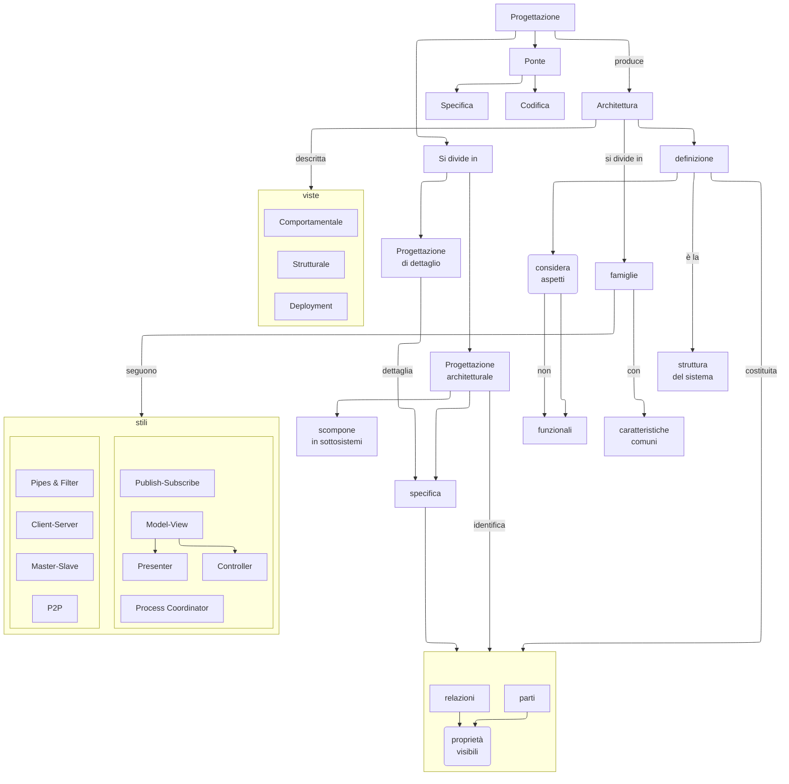
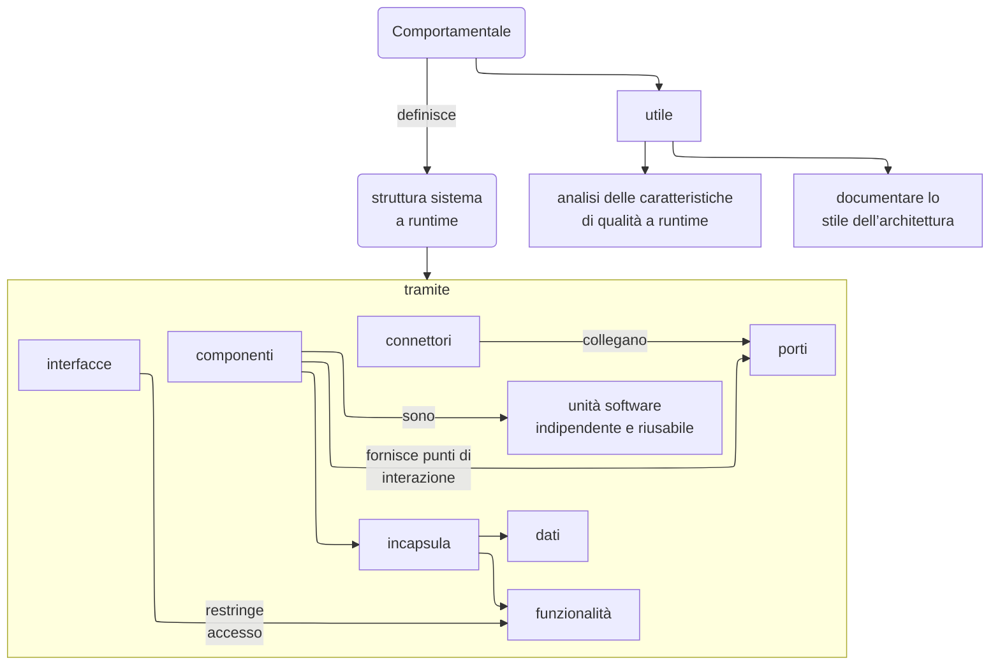
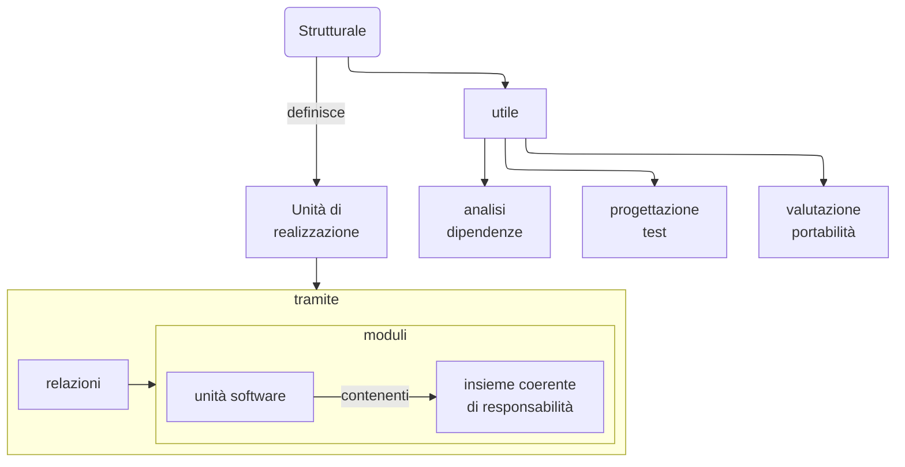
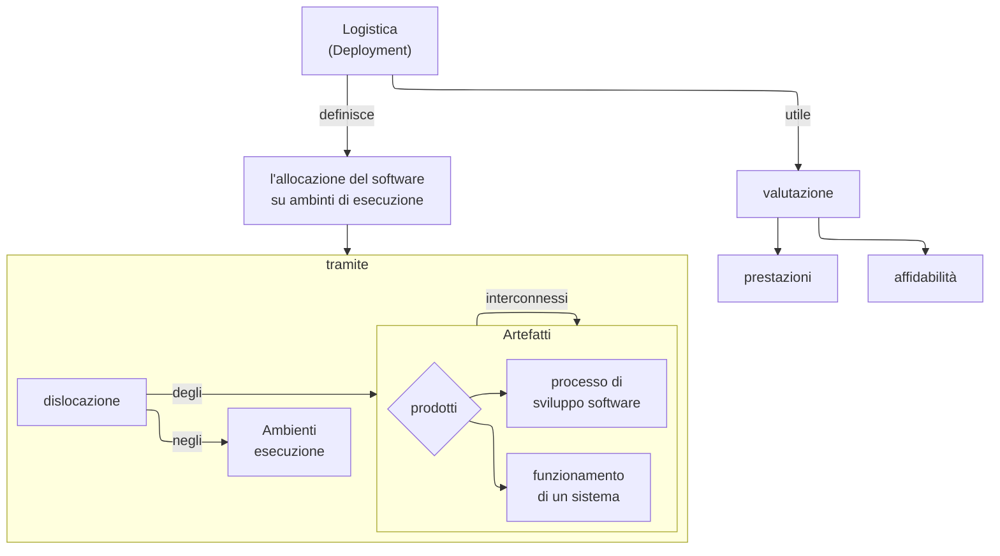
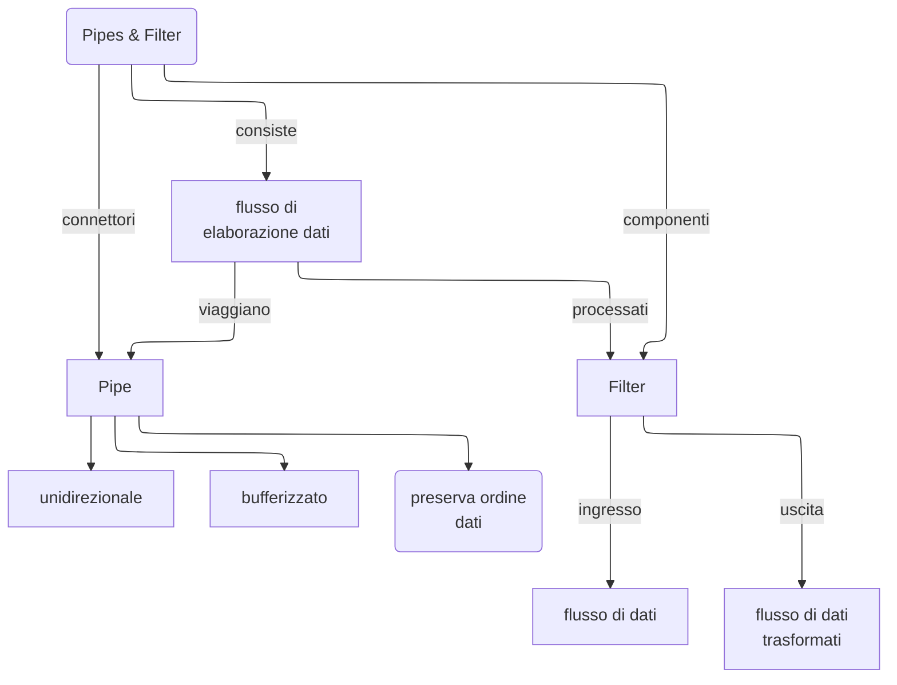
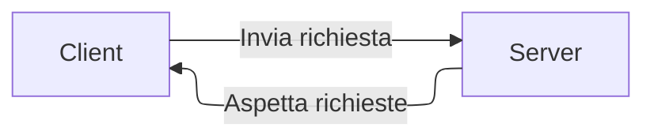
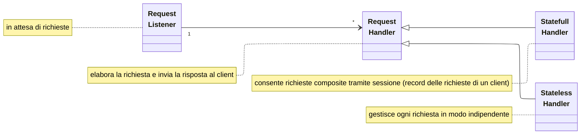

```mermaid
---
config:
  layout: elk
  elk: {
    nodePlacementStrategy: "NETWORK_SIMPLEX"
  }
---
graph TB
    P[Progettazione] --> Pon[Ponte]
    Pon --> Specifica
    Pon --> Codifica
    Pon ~~~ A ~~~ Div

    P -->|produce| A[Architettura]

    P --> Div[Si divide in]
    Div --> PA[Progettazione<br>architetturale]
    PA --> PA_Des1[scompone<br>in sottosistemi]
    PA -->|identifica| PRPV
    PA --> specifica --> PRPV
    Div --> PD[Progettazione<br>di dettaglio]
    PD -->|dettaglia| specifica

    A --> Def[definizione]
    Def -->|è la|SS[struttura<br>del sistema]
    Def -->|costituita| PRPV
    subgraph PRPV [ ]
        parti & relazioni --> PV(proprietà<br>visibili)
    end
    Def --> ca(considera<br>aspetti)
    ca --> funzionali
    ca -->|non| funzionali
    A -->|descritta| viste
    subgraph viste
    direction TB
        Comportamentale ~~~
        Strutturale ~~~
        Deployment
    end
    A -->|si divide in| famiglie -->|con| car_com[caratteristiche<br>comuni]
    famiglie -->|seguono| stili
    subgraph stili
    direction LR
    subgraph 1 [ ]
    direction TB
        PP[Pipes & Filter] ~~~
        Client-Server ~~~
        Master-Slave ~~~
        P2P
    end
    subgraph 2 [ ]
    direction TB
        Publish-Subscribe ~~~
        Model-View-->Controller & Presenter ~~~
        PC[Process Coordinator]
    end
    1 ~~~ 2
    end
```

# Viste

## Comportamentale

```mermaid
---
config:
  layout: elk
---
flowchart TD
    VC(Comportamentale) -->|definisce| VSSE(struttura sistema<br>a runtime) --> tramite
    subgraph tramite
    direction LR
        interfacce ~~~ componenti ~~~ connettori
        componenti -->|sono| comp_des[unità software<br>indipendente e riusabile]
        componenti --> incapsula --> funzionalità & dati
        componenti -->|fornisce punti di<br>interazione|porti
        interfacce -->|restringe<br>accesso| funzionalità
        connettori -->|collegano| porti
    end
    VC(Comportamentale) --> utile --> VU1[analisi delle caratteristiche<br>di qualità a runtime] & VU2[documentare lo<br>stile dell’architettura]
```

---

## Strutturale

```mermaid
---
config:
  layout: elk
---
graph TB
    VS(Strutturale) -->|definisce| UR[Unità di<br>realizzazione]
    VS --> utile --> AD[analisi<br>dipendenze] & PD[progettazione<br>test] & VP[valutazione<br>portabilità]
    UR --> tramite
    subgraph tramite
    direction LR
        subgraph moduli
        URM[unità software] -->|contenenti| ICR[insieme coerente<br>di responsabilità]
        end
        relazioni --> moduli
    end
```

---

## Deploymenti

```mermaid
---
config:
  layout: elk
---
graph TB
    VL["Logistica<br>(Deployment)"]
    VL -->|definisce| VLD[l'allocazione del software<br>su ambinti di esecuzione]
    VL -->|utile| valutazione --> prestazioni & affidabilità
    VLD --> tramite
    subgraph tramite
    direction LR
        subgraph Artefatti
            VLP{prodotti} --> proc[processo di<br>sviluppo software] & fun[funzionamento<br>di un sistema]
        end
        AE[Ambienti<br>esecuzione] ~~~ Artefatti
        dislocazione -->|degli| Artefatti
        dislocazione -->|negli| AE
        Artefatti -->|interconnessi| Artefatti
    end
```

# stili

## Pipes & Filter

```mermaid
---
config:
  layout: elk
---
flowchart TD
    PF(Pipes & Filter) -->|consiste|fe[flusso di<br>elaborazione dati]
    fe -->|viaggiano| Pipe
    fe -->|processati| Filter
    PF -->|componenti| Filter
    PF -->|connettori| Pipe

    Filter -->|ingresso| fl[flusso di dati]
    Filter -->|uscita| flt[flusso di dati<br>trasformati]

    Pipe --> unidirezionale & bufferizzato & po(preserva ordine<br>dati)
```

## Client-Server

```mermaid
---
config:
  layout: elk
---
flowchart LR
    Server -->|Aspetta richieste| Client
    Client -->|Invia richiesta| Server
```

### Server

```mermaid
---
config:
  layout: elk
---
classDiagram
direction LR
    class RH["Request<br>Handler"]
    note for RH "elabora la richiesta e invia la risposta al client"
    class SfH["Statefull<br>Handler"]
    note for SfH "consente richieste composite tramite sessione (record delle richieste di un client)"
    class SlH["Stateless<br>Handler"]
    note for SlH "gestisce ogni richiesta in modo indipendente"
    class RL["Request<br>Listener"]
    note for RL "in attesa di richieste"
    RL "1" --> "*" RH
    RH <|-- SfH
    RH <|-- SlH
```

### Client
