# Processo software

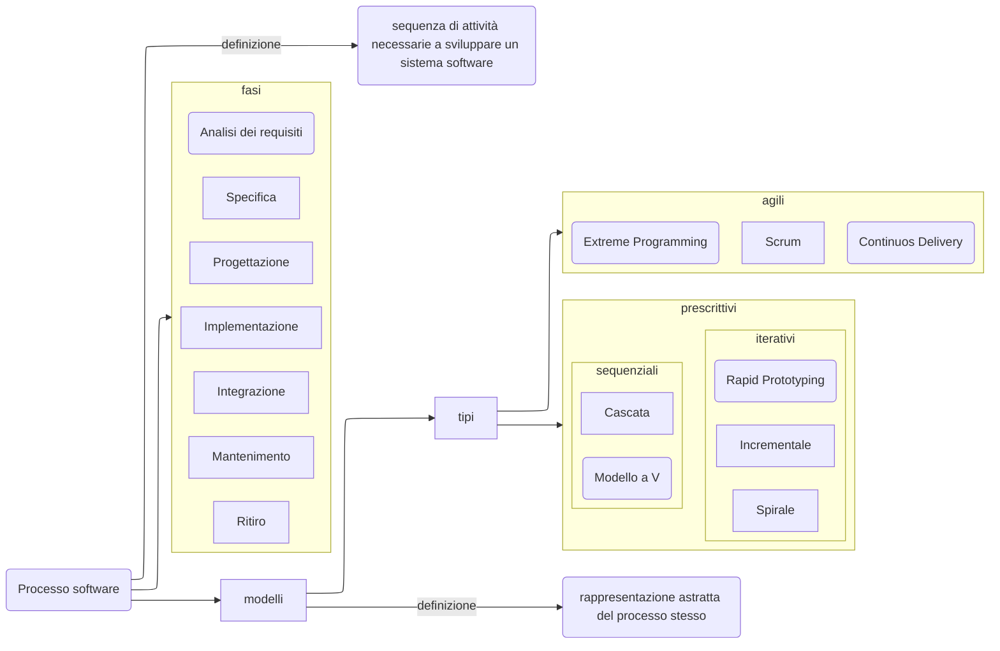

# Analisi dei requisiti

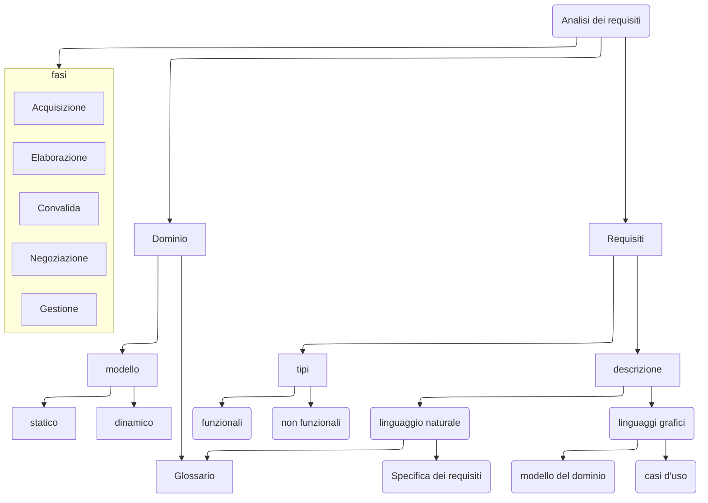

## Fasi

### Acquisizione

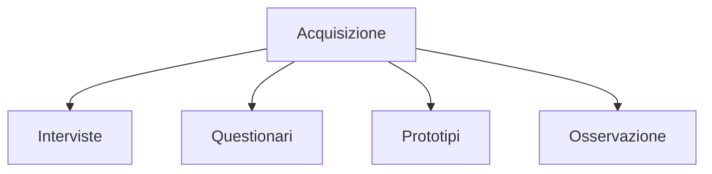

---

### Elaborazione

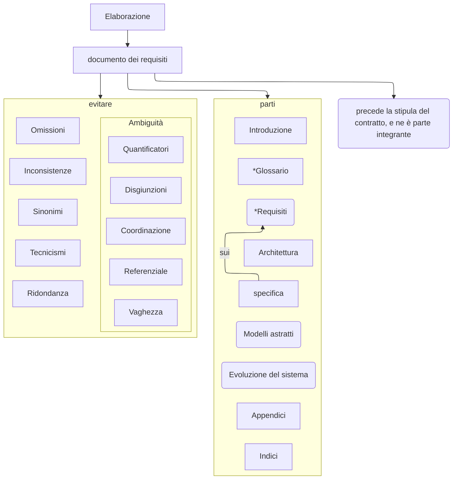

---

### Convalida

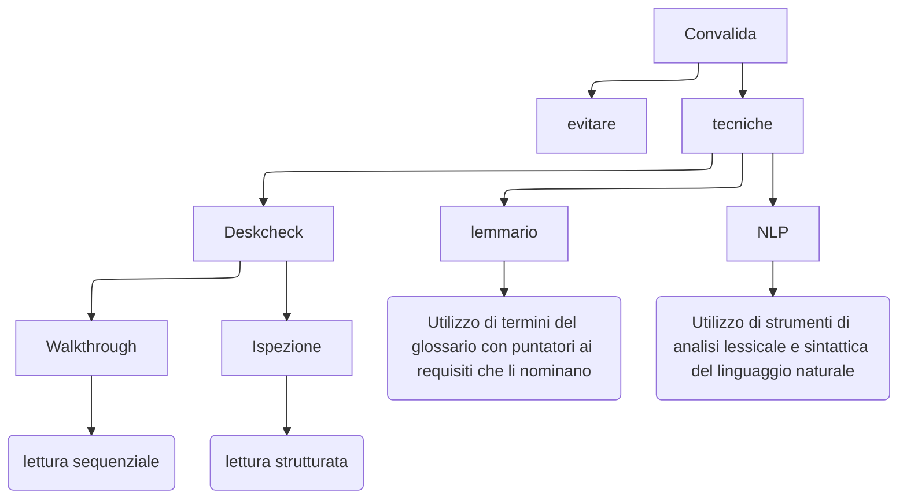

---

### Negoziazione

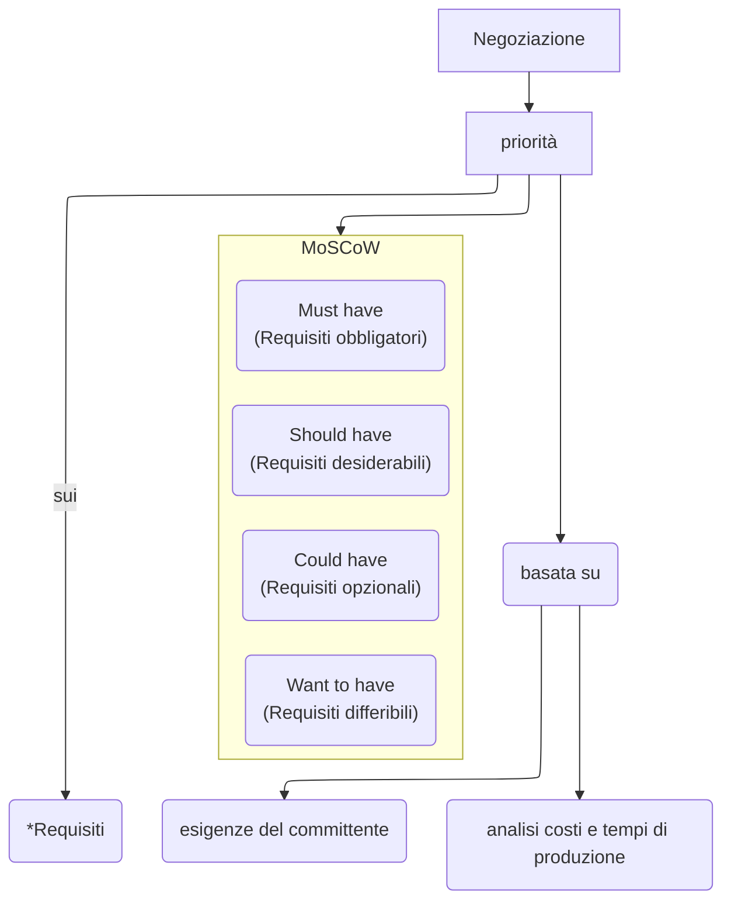

---

### Gestione

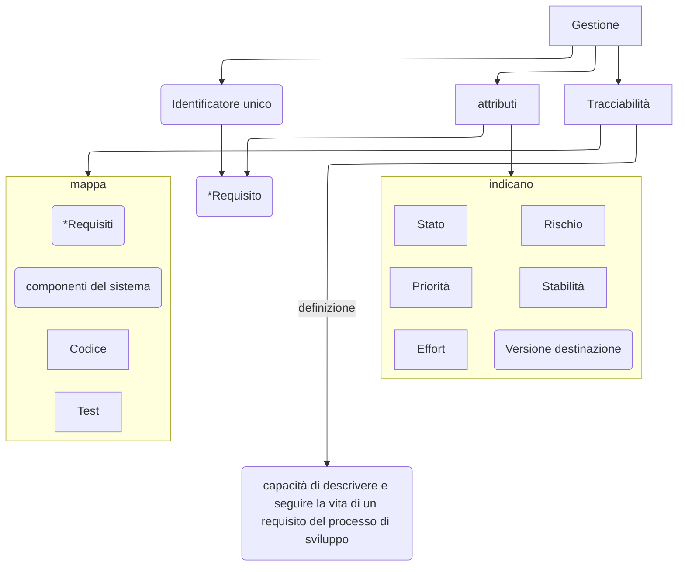

# Progettazione

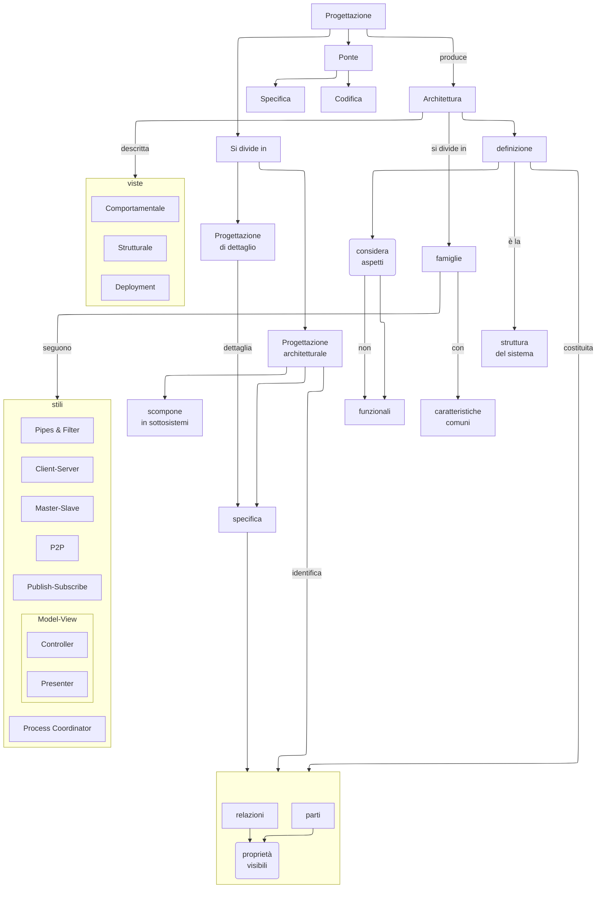

## Viste

### Comportamentale

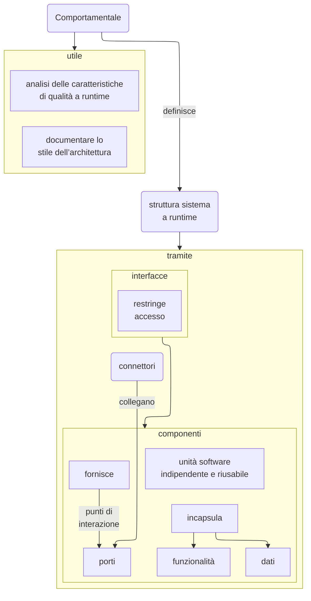

---

### Strutturale

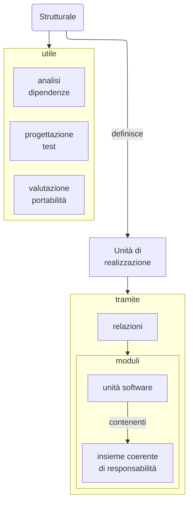

---

### Deploymenti

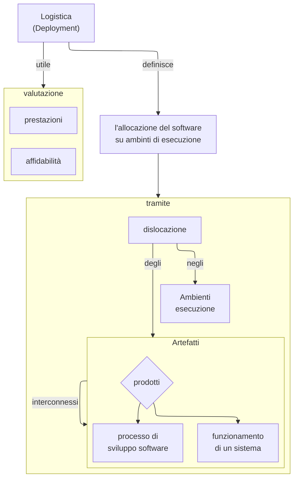

## stili

### Pipes & Filter
